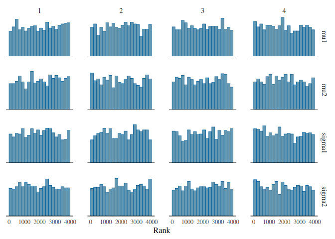

# HW 8 Template
Mark Lai
2024-11-20

- [Research Question](#research-question)
- [Variables](#variables)
  - [Data Import](#data-import)
  - [Variable Summary](#variable-summary)
- [Model](#model)
  - [Analysis](#analysis)
- [Results](#results)

# Research Question

> Is there difference in student evaluation rating for native and
> non-native English-speaking instructors?

# Variables

- `profevaluation`: evaluation rating of the instructor: 1 (very
  unsatisfactory) to 5 (excellent)
- `nonenglish`: 1 = non-native English speakers, 0 = native-English
  speakers

## Data Import

## Variable Summary

Table <a href="#tbl-summ-var" class="quarto-xref">Table 1</a> shows the
summary statistics of evaluationg ratings by groups.

Table 1: Descriptive statistics by groups

|                |           |   Native | Non-Native |
|:---------------|----------:|---------:|-----------:|
| profevaluation |         N |      435 |         28 |
|                |      Mean |     4.19 |       3.94 |
|                |        SD |     0.55 |       0.43 |
|                |       Min |     2.30 |       3.40 |
|                |       Max |     5.00 |       4.80 |
|                | Histogram | ▁▁▃▄▄▆▇▅ |  ▇▆▅▁▁▂▁▇▂ |

# Model

Let $Y$ = profevaluation, $G$ = nonenglish

Model: $$
  \begin{aligned}
    Y_{i, G = 0} & \sim N(\mu_1, \sigma_1) \\
    Y_{i, G = 1} & \sim N(\mu_2, \sigma_2)
  \end{aligned}
$$

Prior: $$
  \begin{aligned}
    \mu_1 & \sim N(3, 2) \\
    \mu_2 & \sim N(3, 2) \\
    \sigma_1 & \sim N^+(0, 2) \\
    \sigma_2 & \sim N^+(0, 2)
  \end{aligned}
$$

## Analysis

We used 4 chains, each with 4,000 iterations (first 2,000 as warm-ups).

# Results

As shown in the rank histogram in
<a href="#fig-rank-hist-fit" class="quarto-xref">Figure 1</a> below, the
chains mixed well.

Figure 1: Rank histogram of the posterior distributions of model
parameters.

<a href="#tbl-summ-fit" class="quarto-xref">Table 2</a> shows the
posterior distributions of $\mu_1$, $\mu_2$, $\sigma_1$, $\sigma_2$, and
$\mu_2 - \mu_1$.

Table 2: Posterior summary of the model parameters.

| variable  |  mean | median |   sd |  mad |    q5 |   q95 | rhat | ess_bulk | ess_tail |
|:----------|------:|-------:|-----:|-----:|------:|------:|-----:|---------:|---------:|
| mu1       |  4.19 |   4.19 | 0.03 | 0.03 |  4.14 |  4.23 |    1 |  4520.75 |  3154.24 |
| mu2       |  3.92 |   3.92 | 0.09 | 0.09 |  3.77 |  4.06 |    1 |  3335.66 |  2727.86 |
| sigma1    |  0.55 |   0.55 | 0.02 | 0.02 |  0.52 |  0.58 |    1 |  4057.43 |  2792.84 |
| sigma2    |  0.46 |   0.45 | 0.07 | 0.06 |  0.36 |  0.57 |    1 |  4143.31 |  2512.62 |
| mu2 - mu1 | -0.27 |  -0.27 | 0.09 | 0.09 | -0.42 | -0.12 |    1 |  3359.23 |  2728.14 |

The analysis showed that on average, non-native speaking instructors
received a lower evaluation rating than native speaker instructors, with
a posterior mean of -0.27 and a 90% CI of \[-0.42, -0.12\].
